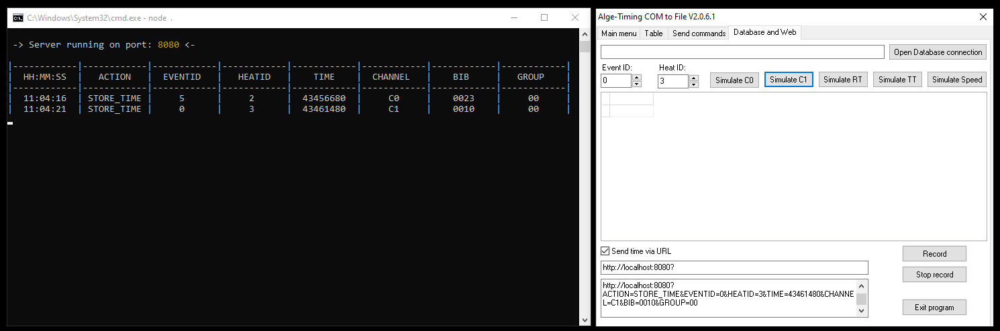

# COM to File to Websocket

This project implements a simple HTTP and WebSocket server that handles incoming requests from ALGE software "COMtoFile".

## Features

- Handles HTTP requests and parses query parameters.
- Uses WebSocket to broadcast received data to connected clients.

## Requirements

- Node.js (version 12 or higher)
- npm (Node package manager)

## Installation

1. **Clone the repository**:

- Click on the green Code button at the top of this repository.
- Select "Download ZIP" to download the repository to your computer.
- Once downloaded, extract the ZIP file, open a CLI, Command Line Interface (Command Prompt, PowerShell, Terminal,...)

2. **Install dependencies**:

In your CLI run:
```bash
npm install
```

3. **Set port number**:

You can change port number (default is 8080) to any other port number you wish editing the file app.js with a text file editor:
```javascript
const PORT = 8080;
```
    

4. **Usage**:

- Start the server. In your CLI run:
```bash
node app.js
```

- Use ALGE "COMtoFile" software to send http request (that software allows simulating requests).

- In "COMtoFile" in the "Database an Web" tab, check the "Send time via URL" and in the box type:
```text
http://localhost:8080?
```
- In "COMtoFile" in the "Database an Web" tab, press "Simulate C0" and "Simulate C1" an you will get the info displayed in this app terminal.



5. **Connect via WebSocket**:

You can connect to the WebSocket server at ws://localhost:8080 to receive broadcast messages of the queries sent.
Run included "index.html" locally as example 


6. **License**:

This project is licensed under the MIT License - see the LICENSE file for details.